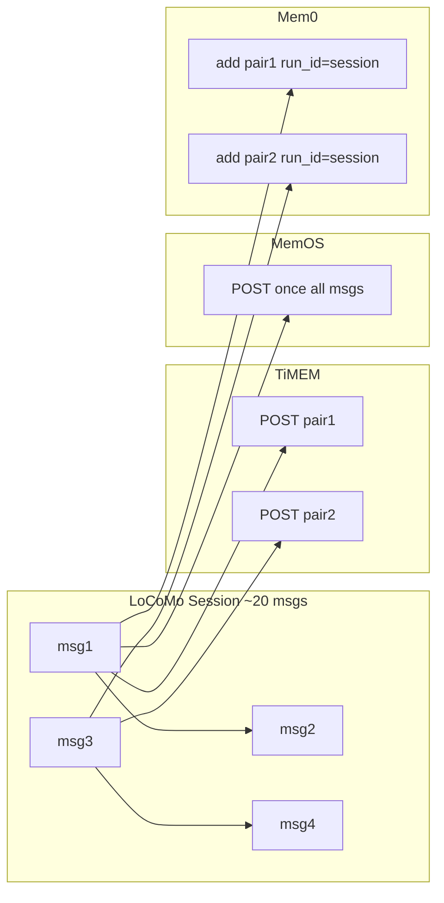

# TiMEM vs MemOS vs Mem0 Benchmark Protocol (v0.5)

## Scope (Phase 1)

Memory only: **ingest** + **retrieval** (performance + recall quality + efficiency).

| System | Base URL | Auth |
|--------|----------|------|
| TiMEM | `http://localhost:8001` | `X-API-Key` |
| MemOS Cloud | `https://memos.memtensor.cn/api/openmem/v1` | `Authorization: Token {MEMOS_API_KEY}` |
| Mem0 Platform | `https://api.mem0.ai` | `Authorization: Token {MEM0_API_KEY}` |
| Judge | Volcengine ARK | `JUDGE_MODEL` endpoint, temperature=0 |

## Identity & Isolation

```
run_id     = YYYYMMDD_NNN          # one benchmark run
persona_id = locomo_persona_{i}    # LoCoMo character (10 personas)

TiMEM user_id  = timem_{run_id}_{persona_id}
MemOS user_id  = memos_{run_id}_{persona_id}
Mem0 user_id   = mem0_{run_id}_{persona_id}
source_session_id = {persona_id}_session_{n}   # LoCoMo dataset id (reports only)
TiMEM session_id (API) = {run_id}_{source_session_id}   # sent on POST /api/v1/memory/
expert_id      = benchmark          # TiMEM only
conversation_id = source_session_id # MemOS only (MemOS uses user_id for isolation)
```

Soft isolation: new `run_id` per run. Hard cleanup is optional (Phase 2).

**TiMEM L2 note:** Backend `memory_sessions.id` is unique per `account_id` (not per `user_id`). Reusing bare LoCoMo `source_session_id` across runs makes `memory_sessions` rows belong to an older `user_id`, so L2 backfill (`POST /api/v1/backfill/manual`) finds zero tasks. The harness namespaces TiMEM `session_id` with `run_id` so sessions align with `timem_{run_id}_{persona_id}`.

**Important:** After ingest-granularity changes (pair-by-pair for TiMEM/Mem0), you must use a **new `run_id`** for re-ingest. Do not compare retrieval metrics against older runs (e.g. LJY) that used whole-session ingest. After this session-id fix, re-ingest with a new `run_id` and verify `ingest.json` → `timem_l2_finalize.l2_ready_count == persona_count`.

## Ingest granularity (per-system)

Each adapter follows the vendor’s recommended write pattern. LoCoMo sessions (~20 messages) are split differently per system:

| System | Mode | API calls / session | Official basis |
|--------|------|---------------------|----------------|
| **TiMEM** | `pair` | ~ceil(msg/2), serial POST | `fragment_size=2`: 2 dialogue turns → 1 L1 fragment |
| **MemOS** | `session` | 1 POST | `add/message` with full conversation; platform extracts memories |
| **Mem0** | `pair` | ~ceil(msg/2), serial POST + event poll | [Contextual Add](https://docs.mem0.ai/platform/features/contextual-add): incremental pairs, `run_id=session_id` |



### Pair splitting (TiMEM & Mem0)

- Chunks are **adjacent 2 messages** (index 0–1, 2–3, …), not role-based.
- LoCoMo maps the two speakers to `role: user1` and `role: user2` **per persona** (alphabetical speaker order, e.g. Caroline→user1, Melanie→user2 across all sessions); structurally each pair is still one turn each way.
- Odd message count: final chunk may contain 1 message (still POSTed).
- TiMEM pairs are **serial** (same scoped `session_id` per session) so L1 context accumulates correctly.
- TiMEM sessions for the **same `user_id` are serial** across sessions (global concurrency still applies across personas). Parallel sessions per user can break L2 generation — the harness serializes per `user_id`.
- L2 is **not** produced by `POST /api/v1/memory/` alone. When enabled, after ingest the harness runs **L2 backfill + wait** (`ingest.json` → `timem_l2_finalize`). Backfill must report `stats.total_tasks > 0`; otherwise finalize fails fast (no 600s idle wait).
- **Dashboard**: checkbox **「Ingest 后等待 TiMEM L2」** (`wait_timem_l2_on_ingest`, default **off**). Unchecked ingest ends after memory writes (`timem_l2_finalize.skipped=true`); use manual Backfill or T0 retrieval (L2 safety net) later. **CLI** `ingest` still waits for L2 by default; pass `--no-wait-timem-l2` to skip.

### LoCoMo scale (10 personas)

~272 sessions × ~10 pairs ≈ **2700+ POST calls** per system for TiMEM and Mem0. Ingest wall time increases significantly vs whole-session ingest.

Ingest reports record per session: `api_calls`, `pair_count`, `ingest_mode` (`pair` | `session`), optional `pair_details` (per-add timings).

**Ingest latency granularity (TiMEM / Mem0 / MemOS):**

| Field | Meaning |
|-------|---------|
| `latency` / `add_latency` | **Primary**: p50/p95 over **single add** (1 pair POST for TiMEM/Mem0; 1 session POST for MemOS) |
| `session_latency` | p50/p95 over **whole session** ingest wall (all pairs + Mem0 flush) |
| `add_count` | Total successful add operations |
| `sum_latency_ms` | Sum of all add latencies (work for parallel efficiency) |
| `add_latency_estimated` | `true` if backfilled from `session_latency / api_calls` (no raw `pair_details`) |
| `pair_details[]` | Per pair: `post_ms`, `poll_ms`, `latency_ms` (Mem0 deferred allocates flush evenly) |

Backfill existing reports: `python scripts/migrate_ingest_add_latency.py --run-id LJY_NEW`

## Ingest concurrency (Benchmark harness)

Session **pairs** remain serial inside each adapter (TiMEM/Mem0 official semantics). The harness parallelizes **across sessions** and optionally **across systems**:

| Setting | Default | Description |
|---------|---------|-------------|
| `ingest.session_concurrency` | 10 | Max concurrent sessions per system (TiMEM/MemOS) |
| `ingest.mem0_session_concurrency` | 10 | Mem0 session cap |
| `ingest.system_parallel` | true | Run timem/memos/mem0 ingest concurrently |
| `ingest.mem0_poll_mode` | `deferred` | `sync` \| `deferred` \| `pipeline` |
| `ingest.mem0_poll_concurrency` | 10 | Parallel event polls during deferred flush |

**Mem0 poll modes:**
- `sync`: wait for each event after every pair POST (slowest, original behavior)
- `deferred`: POST all pairs in a session, then flush events (default)
- `pipeline`: poll pair N−1 while POSTing pair N

Ingest end and T0 retrieval call `flush_pending_events()` for any remaining Mem0 events.

Report fields: `run_wall_ms`, `sum_latency_ms`, `concurrency_settings`, `mem0_flush` (`pending_events_flushed`, `flush_ms`).

## Dataset

- **Source**: LoCoMo (HuggingFace / GitHub mirror / fixture)
- **Subset**: first **10 personas** (configurable in `config/default.yaml`)
- Each persona: all sessions ingested under one `user_id`
- QA pairs used for retrieval evaluation (with `category` for breakdown)

## Benchmark Presets

Two retrieval presets in `config/default.yaml`:

| Preset | top_k | T0 search_mode | T1 search_mode | Use case |
|--------|-------|----------------|----------------|----------|
| **stable** (default) | 10 | `enhanced_semantic` | `enhanced_semantic` | Default; aligns with TiMEM API |
| **paper** | 20 | `enhanced_semantic` | `enhanced_semantic` | Larger recall budget (top_k=20) |

CLI: `python main.py full --preset paper --personas 10`

TiMEM-only parameter sweep: `python main.py timem-sweep --fixture --mode T1`

## Ingest

Per-system granularity is documented in **Ingest granularity** above. Summary:

### TiMEM (pair-by-pair)

Serial POST per adjacent 2 messages, same `session_id`:

```
POST /api/v1/memory/?format=compact
{
  "user_id": "timem_{run_id}_{persona_id}",
  "expert_id": "benchmark",
  "session_id": "{run_id}_{persona_id}_session_{nn}",
  "messages": [{"role": "user1|user2", "content": "..."}],  // 1–2 msgs per call
  "memory_levels": ["L1"]
}
```

### MemOS Cloud (whole session)

```
POST /add/message
{
  "user_id": "...",
  "conversation_id": "...",
  "messages": [...]   // full session in one request
}
```

### Mem0 Platform (pair-by-pair, Contextual Add)

```
POST /v3/memories/add/
{
  "user_id": "...",
  "run_id": "<session_id>",
  "messages": [...],   // 1–2 msgs per call
  "metadata": {"session_id": "..."}
}
```

Processing is **asynchronous** (Mem0 only). The adapter polls `GET /v1/event/{event_id}/` until `SUCCEEDED` **per pair** before returning. Ingest latency includes all poll waits.

Record: `latency_ms`, `input_tokens` (estimated), `success`, `error`, `api_calls`, `pair_count`, `ingest_mode`.

## Retrieval Modes

| Mode | When | TiMEM | MemOS | Mem0 |
|------|------|-------|-------|------|
| **T0** | After ingest | search | searchMemory | search (after event ready) |
| **T1** | After TiMEM L2–L5 backfill | search | same as T0 | same as T0 |

### TiMEM search (configurable)

```
POST /api/v1/memory/search
{
  "user_id": "...",
  "query_text": "...",
  "character_id": "benchmark",
  "limit": <top_k>,
  "format": "full",
  "config": {
    "search_mode": "semantic | enhanced_semantic",
    "use_hybrid": true,
    "enable_memories_rethink": false
  }
}
```

Runtime overrides via CLI/Dashboard `timem_overrides`.

### MemOS search

```
POST /search/memory
{
  "user_id": "...",
  "query": "...",
  "conversation_id": "<optional>"
}
```

### Mem0 search (V3)

```
POST /v3/memories/search/
{
  "query": "...",
  "filters": {"user_id": "..."},
  "top_k": 10,
  "threshold": 0.0
}
```

Record: `latency_ms`, `recalled_tokens`, `result_count`, normalized `MemoryRecord[]`.

## TiMEM Backfill (T1)

```
POST /api/v1/backfill/manual
{
  "account_id": "<from env>",
  "user_id": "...",
  "expert_id": "benchmark",
  "layers": ["L2", "L3", "L4", "L5"],
  "force_update": true
}
```

Poll completion: search with `layer` filter or layer counts until stable or **600s** timeout.

Backfill report: `reports/{run_id}/backfill.json` with `backfill_api_ms`, `backfill_wait_ms`, `backfill_total_ms` per persona.

### Manual Backfill (Dashboard only)

Independent job type `backfill` (does **not** run retrieval). Trigger from **实验** or **检索** page: **仅 TiMEM Backfill**.

- Request body: `{ "type": "backfill", "backfill_layers": ["L2"] }` (user-selected subset of L2–L5; default UI: L2 only)
- Does **not** change T1 / Full backfill layers (still `config/default.yaml` → `benchmark.backfill_layers`)
- Requires prior Ingest for the same `run_id`
- Output: `reports/{run_id}/backfill.json` with `"mode": "manual"`

### Pipeline (Dashboard: Ingest → Backfill → T0)

Job type `pipeline` — **实验** page: **一键 Pipeline（Ingest → Backfill → T0）**.

1. **Ingest** all selected systems (`wait_timem_l2_on_ingest` forced off in UI; use Backfill step instead)
2. **TiMEM Backfill** if `timem` ∈ `systems` and `backfill_layers` non-empty (UI L2–L5 checkboxes; empty → skip)
3. **T0 retrieval** (+ ARK Judge if enabled); T0 L2 safety net still runs if Backfill skipped or omitted L2

Does **not** run T1. Does **not** change Full / T1 default backfill layers.

## Normalized Memory Record

```python
MemoryRecord(
  id, content, memory_type,  # factual|preference|fragment|summary|unknown
  source_system,             # timem|memos|mem0
  layer,                     # L1-L5 or None
  score,
  metadata
)
```

## Evaluation Metrics

### Performance (time)

- Ingest: p50 / p95 **per add** (`add_latency`; TiMEM/Mem0 pair, MemOS session); `session_latency` for whole conversation; `run_wall_ms` per system
- Retrieval: p50 / p95 latency per QA query; `run_wall_ms`
- Backfill (TiMEM T1): `backfill_api_ms`, `backfill_wait_ms`, `backfill_total_ms`
- Judge (optional): `judge_latency_ms`, `total_judge_tokens` per run

### Efficiency (tokens)

- **recalled_tokens**: top-K retrieved memory `content` joined with newlines, counted with `tiktoken` `cl100k_base`
- **per_record_tokens** / **token_count** (in `details[].records[]`): single-memory token length
- **layer_breakdown** (TiMEM): per-layer token sum (may differ slightly from joined total)
- Run-level: `avg_recalled_tokens`, `p50`/`p95`/`min`/`max`, `avg_recalled_tokens_nonempty` (excludes empty recalls)
- **input_tokens** (ingest): dialogue text token estimate
- Judge tokens are **separate** from recalled memory tokens
- **Reference baselines** (`reference_baselines.yaml`) are only comparable at the same `preset` / `top_k`

Token counting matches MemOS HuggingFace eval tables: memory text length only, not answer-generation tokens.

### Cross-system token compare

After retrieval, writes `reports/{run_id}/token_compare_{T0|T1}.json`:
- Per-question `recalled_tokens` per system + `token_delta` (e.g. `timem_vs_memos`)
- Summary: `avg_tokens_by_system`, `efficiency_score` (judge_accuracy / avg_tokens × 1000), `avg_tokens_by_category`

### Retrieval concurrency (Benchmark harness)

| Setting | Default | Description |
|---------|---------|-------------|
| `retrieval.query_concurrency` | 10 | Parallel QA search calls (memos / mem0) |
| `retrieval.timem_query_concurrency` | 3 | Parallel QA search calls for TiMEM (keep low: each workflow holds multiple PG connections) |
| `retrieval.judge_concurrency` | 10 | Parallel ARK judge calls (429 retry enabled) |
| `retrieval.backfill_concurrency` | 3 | Parallel TiMEM backfill personas (T1 / L2 finalize) |
| `retrieval.pipeline_mode` | true | Search→Judge pipeline (overlap phases); `false` = two-phase batch |
| `retrieval.system_parallel` | true | Run timem/memos/mem0 retrieval concurrently |
| `retrieval.judge_max_retries` | 3 | ARK 429/5xx exponential backoff attempts |

CLI:

```bash
python main.py retrieve <run_id> --query-concurrency 10 --judge-concurrency 10 --backfill-concurrency 3
python main.py retrieve <run_id> --no-pipeline   # disable pipeline for comparison
```

Dashboard job options: `retrieval_overrides` (`query_concurrency`, `timem_query_concurrency`, `judge_concurrency`, `backfill_concurrency`, `pipeline_mode`).

Report field `concurrency_settings.effective_query_concurrency` records the per-system value used (10 for TiMEM by default).

Report fields: `concurrency_settings`, `top_k`, `run_wall_ms`, `sum_search_latency_ms`, `sum_work_ms`, `total_judge_latency_ms` (sum, not wall).

**Timing semantics (parallel runs):**

| Field | Meaning |
|-------|---------|
| `run_wall_ms` | Per-system wall clock for QA search (+ judge if enabled) |
| `latency.p50` / `p95` | Per-query **search API** latency only (not judge, not queue wait) |
| `sum_search_latency_ms` | Sum of per-query search latencies |
| `total_judge_latency_ms` | Sum of per-query judge latencies (not judge phase wall time) |
| `sum_work_ms` | `sum_search + sum_judge`; use with `run_wall_ms` for parallel efficiency |
| Parallel efficiency | `sum_work_ms / run_wall_ms` (same idea as ingest `sum_latency_ms / run_wall_ms`) |
| `backfill_summary.backfill_wall_ms` | T1 wall clock for entire parallel backfill phase |
| `backfill_summary.backfill_total_ms.p50` | p50 of **per-persona** backfill duration (not phase wall) |

Note: with `system_parallel: true`, each system has its own `run_wall_ms`; three systems run concurrently so total job wall ≈ max(system walls) + T1 backfill wall, not sum.

### Recall (LoCoMo QA)

- **Recall@K** (K=5, 10): gold keywords/entities in top-K results
- **ARK Judge**: `can_answer` (yes/no), `score` (0–1), shared prompt for all systems

### Category breakdown

- LoCoMo categories mapped: `1=single_hop`, `2=temporal`, `3=multi_hop`, `4=open_domain`
- Output: `reports/{run_id}/summary_by_category_{T0|T1}.json`

### TiMEM parameter sweep

- Output: `reports/{sweep_id}/sweep_matrix.json`
- Each row: param combo + recall/judge/latency/token aggregates

## Defaults

| Parameter | Value |
|-----------|-------|
| `preset` | `stable` |
| `top_k` (stable) | 10 |
| `top_k` (paper) | 20 |
| `expert_id` | benchmark |
| `persona_count` | 10 |
| `mem0_search_threshold` | 0.0 |
| `mem0_ingest_poll_timeout_sec` | 120 |
| `judge_model` | ARK endpoint id (env `JUDGE_MODEL`) |
| `judge_temperature` | 0 |

## Fairness Appendix

1. **T1 asymmetry**: Only TiMEM runs L2–L5 backfill before T1 search. MemOS/Mem0 T1 re-runs the same search as T0. Label MemOS/Mem0 T1 as "same as T0" in comparisons.
2. **Mem0 ingest semantics**: Mem0 ingest latency includes async event polling **per pair**; TiMEM pair ingest is serial synchronous POSTs; MemOS is one synchronous POST per session.
3. **Ingest granularity**: TiMEM/Mem0 use pair-by-pair writes; MemOS uses whole-session batch. Old runs (whole-session TiMEM/Mem0) are not comparable—re-ingest with a new `run_id`.
4. **Token counting**: Harness-side `cl100k_base` estimate on recalled memory text. May differ slightly from vendor-internal counters.
5. **Not measured**: MemOS Chat API, KV-cache injection, load/stress testing, hard cleanup.
6. **Reference baselines**: `benchmark_data/reference_baselines.yaml` stores published numbers for dashboard overlay only (not auto-run).

## Out of Scope (Phase 1)

- Load / stress testing
- Experience learning, user profile
- MemOS Chat API, knowledge base
- Mem0 self-hosted OSS (Platform only)
- Hard delete / cleanup after run
